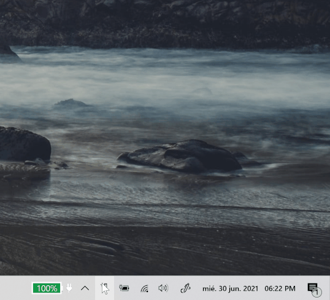

# Scratchpad

A small text editor that lives in the tray to take quick notes. The
contents are saved to a plain text file.

## Requirements

1. [Microsoft Visual C++ 2015 Redistributable Update 3 RC](https://www.microsoft.com/en-us/download/details.aspx?id=52685)

## Install

1. Download the latest `scratchpad.zip` from the releases page.
2. Extract it to any directory. For example: `C:\Utils`
3. Run `scratchpad.exe`

## Notes

This was an interesting first project to learn Rust. Thanks to [Gabriel Dube](https://github.com/gabdube) for creating native-windows-gui, a nice toolkit for small native Win32 apps.

